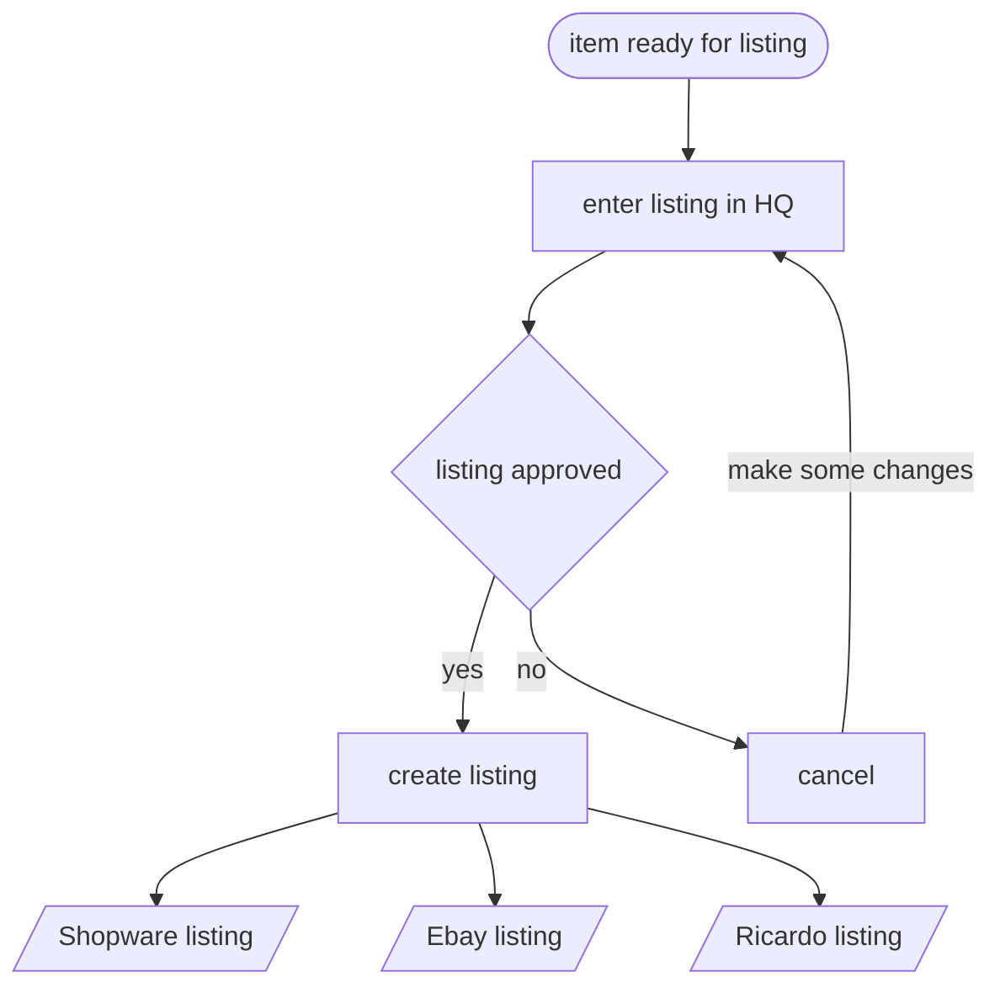

# fotohaus-triage

## listing an item

### api

| platform | method | possible |
| -------- | ------ | -------- |
| shopware | https://developers.shopware.com/developers-guide/rest-api/api-resource-article/#post-(create) | ✅ |
| ebay | https://developer.ebay.com/api-docs/sell/inventory/resources/inventory_item/methods/bulkCreateOrReplaceInventoryItem   https://developer.ebay.com/api-docs/sell/inventory/resources/offer/methods/createOffer | ✅ |
| ricardo | https://ws.ricardo.ch/RicardoApi/documentation/html/M_Ricardo_Contracts_ISellService_CreateArticle.htm   https://ws.ricardo.ch/RicardoApi/documentation/html/M_Ricardo_Contracts_ISellService_AddArticlePictures.htm | ✅ |

### flow

## deleting and item

### api

| platform | method | possible |
| -------- | ------ | -------- |
| shopware | https://developer.ebay.com/api-docs/sell/inventory/resources/offer/methods/updateOffer | ✅ |
| ebay | https://developer.ebay.com/api-docs/sell/inventory/resources/offer/methods/deleteOffer | ✅ |
| ricardo | https://ws.ricardo.ch/RicardoApi/documentation/html/M_Ricardo_Contracts_ISellService_CloseArticle.htm | ✅ |

## update / pause and item

### api

| platform | method | possible |
| -------- | ------ | -------- |
| shopware | https://developer.ebay.com/api-docs/sell/inventory/resources/offer/methods/updateOffer | ✅ |
| ebay | https://developer.ebay.com/api-docs/sell/inventory/resources/offer/methods/withdrawOffer   https://developer.ebay.com/api-docs/sell/inventory/resources/offer/methods/updateOffer | ✅ |
| ricardo | https://ws.ricardo.ch/RicardoApi/documentation/html/M_Ricardo_Contracts_ISellService_ModifyArticle.htm   https://ws.ricardo.ch/RicardoApi/documentation/html/M_Ricardo_Contracts_ISellService_RepublishArticle.htm | ✅ |

